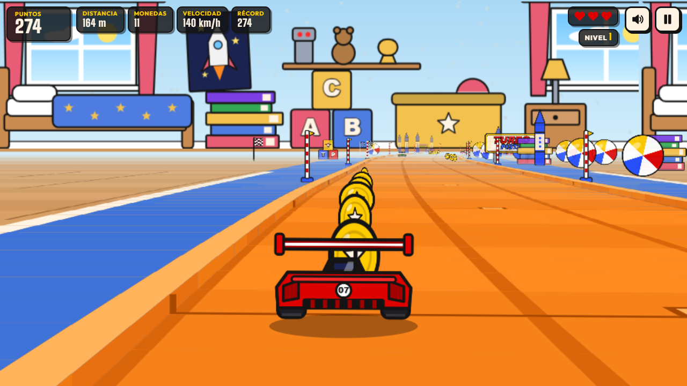
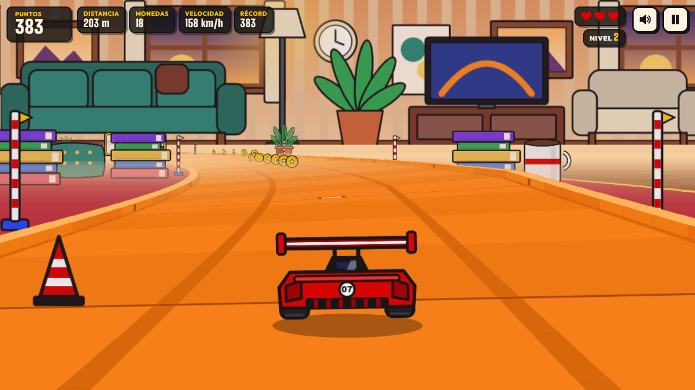
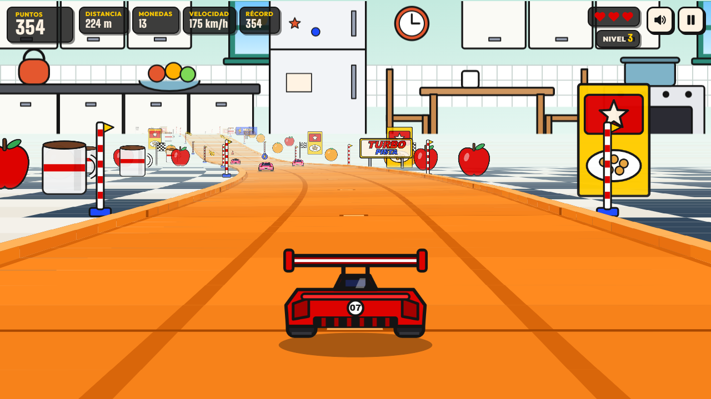
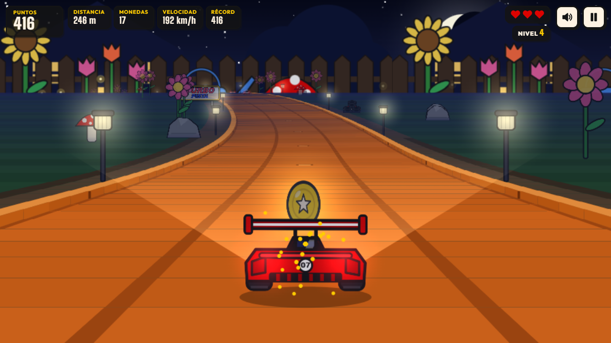

# JUEGOS · TURBO PISTA

**An arcade room of hand-made browser games. The first one is TURBO PISTA, an endless pseudo-3D racer on an orange toy track that runs through a whole house.**

Plain HTML, CSS and JavaScript (Canvas 2D + Web Audio). No frameworks, no build step, no server code, no database.

### ▶ [Play it at samueltorres.dev/juegos](https://samueltorres.dev/juegos/)

Direct links: [TURBO PISTA in Spanish](https://samueltorres.dev/juegos/pista/) · [in English](https://samueltorres.dev/juegos/en/pista/)


| Bedroom | Living room |
|---|---|
|  |  |
| **Kitchen** | **Garden (night)** |
|  |  |

| Blister-pack car select | Loop cinematic | Mobile |
|---|---|---|
|  |  |  |

---

## The game

You race an endless orange plastic toy track, seen from behind the car in the style of classic arcade racers. The track is toy-sized and crosses a house full of giant things. **You only steer left and right**: the car speeds up by itself, and every level is faster.

- **Launch:** at the start the car sits in a spring booster. It is pulled back one click per countdown light and fired off the line on GO.
- **Dodge:** cones, oil slicks (they make you skid), slower rival cars and holes in the track. Rubbing the rails throws sparks and costs speed.
- **Collect:** coins for points and **nitro** bolts. Nitro is a temporary boost with a toy-style zoom punch, a radial zoom blur and speed lines, and it lets you smash through cones.
- **Fly:** ramps launch the car **between tables** and through the middle of a **fire hoop**. Once per level there is a **loop**: a side-view cinematic where the car goes all the way around by itself.
- **Banked curves:** some curves are tight but tilted, and the banking holds the car in.
- **Survive:** you have 3 lives. After a crash the car blinks and is invulnerable for a moment.
- **Levels:** every level is a different room. You go from the bedroom to the living room, the kitchen and then the garden at night (with headlights, stake lights and fireflies), and then the cycle repeats, harder. You drive through a doorway into each new room, and a “¡NIVEL 2!” banner announces it.
- **Pick a car:** four original cars drawn in code. They have no names and are told apart only by color, race number and their stats:
  - **07**, a low, wide modern track car.
  - **21**, a long, powerful classic American muscle car.
  - **33**, a smooth 90s-style Japanese coupe.
  - **88**, an over-the-top fantasy hot rod.

  Each one has different speed, acceleration and handling, so it drives a little differently.
- **Real collection:** the car select links to my real toy car collection at [samueltorres.dev/garage](https://samueltorres.dev/garage/).
- **Score:** the HUD shows score, distance, coins, speed and your best score, which is saved in `localStorage`. **Share** uses the Web Share API, or copies a text with the link.

### Controls

| | Steer | Pause |
|---|---|---|
| Keyboard | `←` `→` or `A` `D` | `Space`, `P` or `Esc` |
| Touch | Tap the left or right half, drag sideways, or use the big on-screen buttons | ⏸ button |

The game pauses by itself when you switch tabs or the window loses focus. The mute button remembers your choice.

---

## How it's made

### Pseudo-3D road (`track.js`, `render.js`)

The track is a list of short **segments**. Each one stores a curve value, a bank value and the height of its two edges. Every frame:

1. **Project, near to far.** Each segment edge is projected with `scale = cameraDepth / z`, then `x = W/2 + scale·(worldX − cameraX)·Sx` and `y = horizon − scale·(worldY − cameraY)·Sy`. Curves are not real geometry. An offset `dx` grows by each segment's curve and shifts everything after it sideways, which bends the road with no 3D math.
2. **Paint, far to near** (painter's algorithm). Each segment draws its floor band (planks, a rug, kitchen tiles or grass). Then come any table top, the orange plastic track with its lane grooves, the joints between pieces and the side rails, then any hole. The sprites standing on the segment are drawn last. Nearer segments are painted on top, so hills and table edges hide what is behind them without any clipping.
3. **Banking.** In a banked curve only the outer edge rises, so the road never dips under the next segment's floor. The car leans and lifts with the road.
4. **Tables.** In a jump section the floor under the gap is lower than the table top. The first segment of the far table rises steeply, so it paints as the table's front, with its apron, shadow and legs. The camera keeps the table height while the car flies over the gap.
5. **Fewer draw calls.** Far segments thinner than about 3 px are merged into a single strip, and quads of the same color are batched into one path. Floor details (seams, tiles, the rug border) are only drawn close to the camera.

The x and y scales (`Sx`, `Sy`) and the horizon depend on the aspect ratio. That way the road isn't stretched in portrait on a phone, and landscape keeps the classic flat arcade look.

### Rooms (`scenes.js`, `palette.js`)

Each room is drawn **once per screen size** into a single wide bitmap. The bitmap holds the wall, its decoration (windows, posters, shelves, tiles) and the giant furniture standing on the floor. The renderer scrolls it with the curves, so each frame only copies one image. Two rooms crossfade while you go through the doorway.

### Endless track

The track is **generated ahead of the car in sections**: straights, curves, banked curves, S-curves, hills, table jumps with a fire hoop, and one loop per level. Segments behind the camera are dropped in batches, so memory stays constant however long you drive. Difficulty comes from the level (top speed, gap between obstacle rows, rivals, holes, curve strength).

Obstacle rows always **leave one lane free**, and that free lane is never more than one lane away from the previous one. A run is never impossible.

### Game loop (`engine.js`)

- `requestAnimationFrame` with **delta time**, split into fixed 1/120 s physics steps. Speed and collisions behave the same at 30, 60 or 144 Hz.
- Frame time is capped at 100 ms after a hiccup.
- Collisions **sweep** every segment the car crossed during the step, so fast cars never tunnel through a cone.
- An exponential average of the frame time **lowers the canvas resolution** on slow devices, and the backing store is capped at about 2.3 megapixels.

### Sprites (`cars.js`, `sprites.js`)

Every car, cone, coin, giant book, crayon, ball, mug, fruit, flower and stake light is **drawn with Canvas paths** at start-up and cached as a bitmap. Each one gets a tinted copy per room. Lights are added on top with additive blending, using a radial glow that is baked once per color.

### Sound (`audio.js`)

There are no audio files: everything is **synthesized with the Web Audio API**.

- The car is a small toy motor plus the rattle of plastic wheels: band-passed noise pulsed by an LFO that speeds up with the car.
- Each joint between track pieces makes a subtle **clack**.
- The booster ratchets during the countdown and fires with a wobbling **spring boing**.
- The blister pack crinkles open.
- Coins, nitro, crashes, skids, jumps, the fire hoop, the loop, the countdown and the level-up jingle are short oscillator and noise envelopes.

### Accessibility and quality

- Menus are real HTML: buttons, a radio group for the cars, focus moved into each screen, and keyboard navigation.
- Each car's label is read out with its number, color and stats.
- Screen readers get live announcements (level, lives, final score).
- With `prefers-reduced-motion` the game drops camera shake, the zoom punch and blur, strong flashes, blinking and the blister animation, and it shows static banners.
- `localStorage` access is wrapped in `try/catch`, so private windows work.
- It is bilingual: `/juegos/` in Spanish and `/juegos/en/` in English.

### Project structure

```
index.html, en/index.html        arcade home (ES / EN)
assets/                          shared CSS, self-hosted fonts (OFL), images
pista/index.html                 TURBO PISTA in Spanish
en/pista/index.html              TURBO PISTA in English (same code)
pista/css/pista.css              game UI over the canvas (HUD, blister packs, menus)
pista/js/
  main.js       game states and glue (menu → countdown + booster → play ⇄ pause → game over)
  engine.js     requestAnimationFrame loop, fixed steps, adaptive resolution
  track.js      segments, banking, table jumps, section generator, difficulty per level
  render.js     projection, track painter, sprites, booster, fire hoop, doorway, loop cinematic
  scenes.js     the four rooms and their giant furniture, baked into scrolling strips
  player.js     steering, per-car handling, centrifugal force, banking, rails, jumps
  obstacles.js  placement of items, rival cars, collisions, autopilot lane scores
  input.js      keyboard, touch/drag and on-screen buttons
  audio.js      Web Audio synthesizer
  ui.js         HUD, blister-pack car select, countdown lights, banners, toasts, focus
  cars.js       the four original cars (rear and side views) and rivals
  sprites.js    coins, nitro, cones, room scenery, tinted per room
  palette.js    room colors and blending
  i18n.js, storage.js, util.js
```

## Run it locally

Any static web server works (ES modules need `http://`, not `file://`):

```bash
git clone https://github.com/sammyrobin/juegos.git
cd juegos
npx serve .            # or: python -m http.server 8000
```

Then open `http://localhost:3000/pista/` (or port 8000). The links to the portfolio and to the garage point to samueltorres.dev.

Developer URL flags:

| Flag | What it does |
|---|---|
| `?fps` | Shows the FPS, the resolution scale and the update/render time in ms |
| `?autopilot` | The menu AI also drives during a run |
| `?level=3` | Starts a run at level 3 (the kitchen) |

## Deployment

The site lives in my private portfolio repository and is published to `samueltorres.dev/juegos` by its existing FTPS deploy. This repository is a public copy of that folder. The `.htaccess` sets cache headers and adds trailing slashes over https, since the site sits behind Cloudflare.

## Roadmap

- [ ] Online leaderboard (weekly top 10)
- [ ] Gamepad support (Gamepad API) and vibration on crashes
- [ ] More rooms and track pieces: the bathroom, a staircase, tunnels under the sofa and a corkscrew
- [ ] Unlockable paint jobs with collected coins
- [ ] Offline play as an installable PWA
- [ ] Next game in the arcade room

## License

The code is under the [MIT](LICENSE) license. The fonts (Big Shoulders Display, Outfit) are under the SIL Open Font License 1.1.

Every car, logo and piece of artwork is an original design drawn in code. None of it is affiliated with or based on any toy brand, car brand or existing car model.

---

## Resumen en español

**JUEGOS** es la sala de juegos arcade de mi portafolio. El primer juego, **TURBO PISTA**, es una carrera infinita en pseudo-3D sobre una pista de juguete de piezas naranjas que cruza toda la casa, vista desde atrás del auto como en los arcades clásicos. Solo te mueves a la izquierda y a la derecha.

- **Arranque:** un lanzador de resorte te dispara en la salida.
- **Esquiva:** conos, manchas de aceite, autos rivales y huecos. Al rozar los bordes saltan chispas.
- **Junta:** monedas y rayos de nitro, con un efecto de zoom de juguete.
- **Vuela:** saltas entre mesas y pasas por el aro de fuego. Hay curvas peraltadas y un loop por nivel.
- **Cuartos:** cada nivel es un cuarto distinto (cuarto, sala, cocina y jardín de noche), con muebles gigantes.
- **Autos:** hay 4 autos originales y sin nombre: el 07, el 21, el 33 y el 88. Se distinguen por color, número y barras de velocidad, aceleración y manejo, y cada uno maneja distinto. Se eligen en un empaque de blíster que se abre.
- **Tu colección:** el botón “Ver mi colección real” lleva a mi colección de autos a escala en [/garage](https://samueltorres.dev/garage/).

Está hecho solo con **HTML, CSS y JavaScript puro**: Canvas 2D para la pista, la Web Audio API para todo el sonido (ruedas de plástico, el clac de las uniones y el resorte, sintetizado y sin archivos) y un bucle con `requestAnimationFrame`, delta time y pasos fijos. No usa frameworks ni build.

- **Controles:** flechas o A/D en teclado, y en celular tocar o deslizar. Espacio o P pausa.
- **Idiomas:** español en `/juegos/` e inglés en `/juegos/en/`.

**▶ Juega en [samueltorres.dev/juegos](https://samueltorres.dev/juegos/).**
