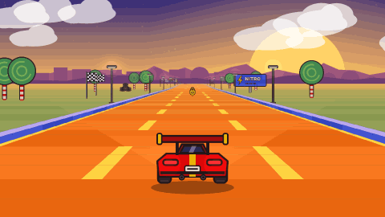
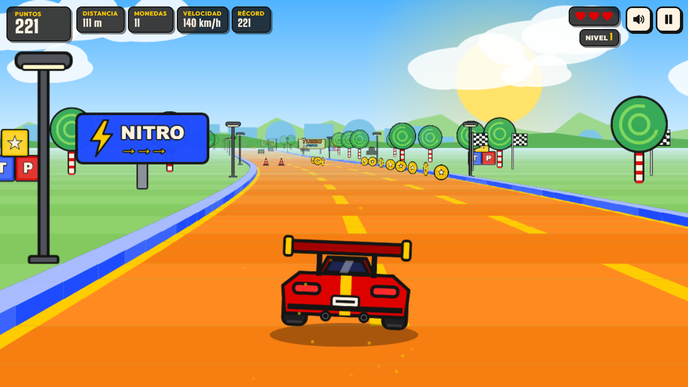
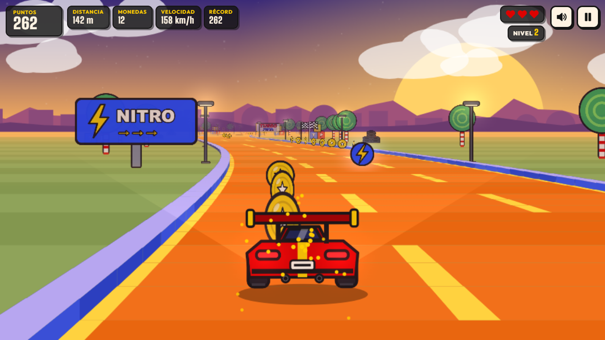
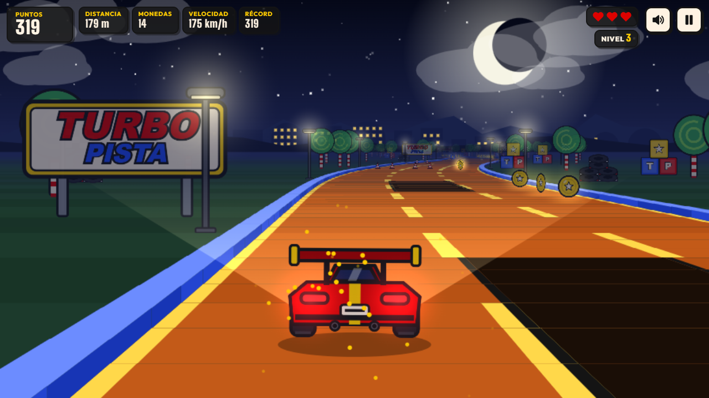
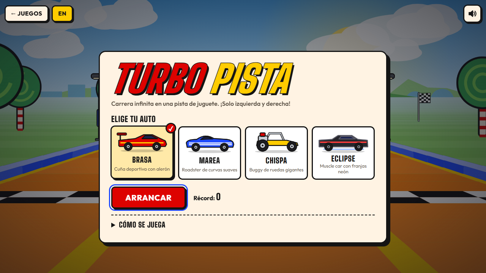
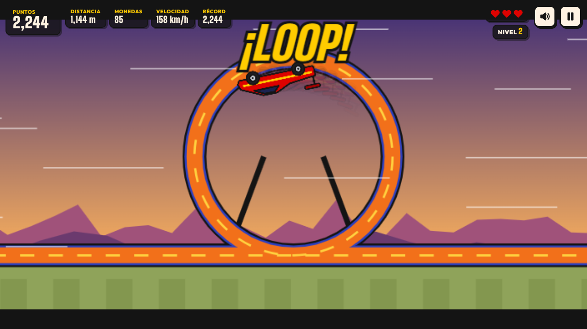
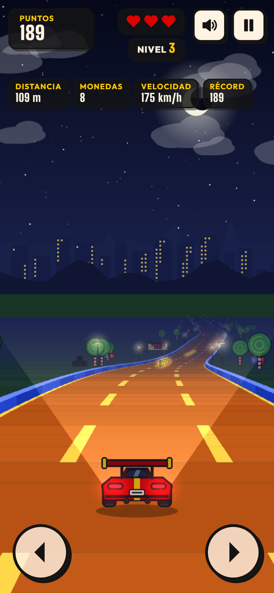

# JUEGOS · TURBO PISTA

**An arcade room of hand-made browser games. The first one is TURBO PISTA, an endless pseudo-3D racer on an orange toy track.**

Plain HTML, CSS and JavaScript (Canvas 2D + Web Audio). No frameworks, no build step, no server code, no database.

### ▶ [Play it at samueltorres.dev/juegos](https://samueltorres.dev/juegos/)

Direct links: [TURBO PISTA in Spanish](https://samueltorres.dev/juegos/pista/) · [in English](https://samueltorres.dev/juegos/en/pista/)



| Day | Sunset | Night |
|---|---|---|
|  |  |  |

| Start screen | Loop cinematic | Mobile |
|---|---|---|
|  |  |  |

---

## The game

You race an endless orange track, seen from behind the car in the style of classic arcade racers. **You only steer left and right**: the car speeds up by itself, and every level is faster.

- **Dodge:** cones, oil slicks (they make you skid), slower rival cars and holes in the track.
- **Collect:** coins for points and **nitro** bolts. Nitro is a temporary boost with speed lines, a slight camera shake and a whoosh, and it lets you smash through cones.
- **Fly:** jump ramps launch the car over gaps and lines of airborne coins. Once per level there is a **loop**: a side-view cinematic where the car goes all the way around by itself.
- **Survive:** you have 3 lives. After a crash the car blinks and is invulnerable for a moment. Curves push the car outwards, and the blue walls scrape your speed away.
- **Levels:** each level changes the scenery, from day to sunset to night (with headlights and street lamps), then the cycle repeats, harder. A “¡NIVEL 2!” banner announces each one.
- **Pick a car:** there are four original cars drawn in code: *Brasa/Ember* (red), *Marea/Tide* (blue), *Chispa/Spark* (yellow) and *Eclipse* (black).
- **Score:** the HUD shows score, distance, coins, speed and your best score, which is saved in `localStorage`. **Share** uses the Web Share API, or copies a text with the link.

### Controls

| | Steer | Pause |
|---|---|---|
| Keyboard | `←` `→` or `A` `D` | `Space`, `P` or `Esc` |
| Touch | Tap the left or right half, drag sideways, or use the big on-screen buttons | ⏸ button |

The game pauses by itself when you switch tabs or the window loses focus. The mute button remembers your choice.

---

## How it's made

### Pseudo-3D road (`track.js`, `render.js`)

The track is a list of short **segments**. Each one stores a curve value and the height of its two edges. Every frame:

1. **Project, near to far.** Each segment edge is projected with `scale = cameraDepth / z`, then `x = W/2 + scale·(worldX − cameraX)·Sx` and `y = horizon − scale·(worldY − cameraY)·Sy`. Curves are not real geometry. An offset `dx` grows by each segment's curve and shifts everything after it sideways, which bends the road with no 3D math.
2. **Paint, far to near** (painter's algorithm). Each segment draws a ground band, the orange road, the lane marks, the raised blue walls and any hole. Then come the sprites standing on it. Nearer segments are painted on top, so hills hide what is behind them without any clipping.
3. **Fewer draw calls.** Far segments thinner than about 2 px are merged into a single strip, and quads of the same color are batched into one path. In a software-rendered test this took the game from about 16 to about 50 FPS.

The x and y scales (`Sx`, `Sy`) and the horizon depend on the aspect ratio. That way the road isn't stretched in portrait on a phone, and landscape keeps the classic flat arcade look.

### Endless track

The track is **generated ahead of the car in sections**: straights, curves, S-curves, hills, jump sections and one loop per level. Segments behind the camera are dropped in batches, so memory stays constant however long you drive. Difficulty comes from the level (top speed, gap between obstacle rows, rivals, holes, curve strength).

Obstacle rows always **leave one lane free**, and that free lane is never more than one lane away from the previous one. A run is never impossible.

### Game loop (`engine.js`)

- `requestAnimationFrame` with **delta time**, split into fixed 1/120 s physics steps. Speed and collisions behave the same at 30, 60 or 144 Hz.
- Frame time is capped at 100 ms after a hiccup.
- Collisions **sweep** every segment the car crossed during the step, so fast cars never tunnel through a cone.
- An exponential average of the frame time **lowers the canvas resolution** on slow devices, and the backing store is capped at about 2.3 megapixels.

### Sprites (`cars.js`, `sprites.js`)

Every car, cone, coin, tree, toy block and billboard is **drawn with Canvas paths** at start-up and cached as a bitmap. Each one gets a tinted copy per time of day. Lights (lamps, tail lights, headlights, glowing coins) are added on top with additive blending at night.

### Sound (`audio.js`)

There are no audio files: everything is **synthesized with the Web Audio API**.

- The engine is two detuned oscillators through a resonant low-pass filter, and its pitch and brightness follow the speed.
- Coins, nitro, crashes, skids, jumps, the loop, the countdown and the level-up jingle are short oscillator and noise envelopes.

### Accessibility and quality

- Menus are real HTML: buttons, a radio group for the cars, focus moved into each screen, and keyboard navigation.
- Screen readers get live announcements (level, lives, final score).
- Colors pass WCAG AA on the cream background.
- With `prefers-reduced-motion` the game drops camera shake, strong flashes and blinking, has fewer speed lines, and shows static banners.
- `localStorage` access is wrapped in `try/catch`, so private windows work.
- It is bilingual: `/juegos/` in Spanish and `/juegos/en/` in English.

### Project structure

```
index.html, en/index.html        arcade home (ES / EN)
assets/                          shared CSS, self-hosted fonts (OFL), images
pista/index.html                 TURBO PISTA in Spanish
en/pista/index.html              TURBO PISTA in English (same code)
pista/css/pista.css              game UI over the canvas
pista/js/
  main.js       game states and glue (menu → countdown → play ⇄ pause → game over)
  engine.js     requestAnimationFrame loop, fixed steps, adaptive resolution
  track.js      segments, section generator, difficulty per level
  render.js     projection, road painter, sprites, particles, loop cinematic
  player.js     steering, centrifugal force, walls, jumps, timers
  obstacles.js  placement of items, rival cars, collisions, autopilot lane scores
  input.js      keyboard, touch/drag and on-screen buttons
  audio.js      Web Audio synthesizer
  ui.js         HUD, menus, countdown lights, banners, toasts, focus
  cars.js       the four original cars (rear and side views) and rivals
  sprites.js    coins, nitro, cones, scenery, tinted per ambient
  palette.js    day / sunset / night colors and blending
  i18n.js, storage.js, util.js
```

## Run it locally

Any static web server works (ES modules need `http://`, not `file://`):

```bash
git clone https://github.com/sammyrobin/juegos.git
cd juegos
npx serve .            # or: python -m http.server 8000
```

Then open `http://localhost:3000/pista/` (or port 8000). The home page's links to the portfolio and to the garage point to samueltorres.dev.

Developer URL flags:

| Flag | What it does |
|---|---|
| `?fps` | Shows the FPS, the resolution scale and the update/render time in ms |
| `?autopilot` | The menu AI also drives during a run |
| `?level=3` | Starts a run at level 3 |

## Deployment

The site lives in my private portfolio repository and is published to `samueltorres.dev/juegos` by its existing FTPS deploy. This repository is a public copy of that folder. The `.htaccess` sets cache headers and adds trailing slashes over https, since the site sits behind Cloudflare.

## Roadmap

- [ ] Online leaderboard (weekly top 10)
- [ ] Gamepad support (Gamepad API) and vibration on crashes
- [ ] More track pieces: tunnels, split roads and a corkscrew
- [ ] Unlockable cars and paint jobs with collected coins
- [ ] Offline play as an installable PWA
- [ ] Next game in the arcade room

## License

The code is under the [MIT](LICENSE) license. The fonts (Big Shoulders Display, Outfit) are under the SIL Open Font License 1.1.

Every car, logo and piece of artwork is an original design drawn in code. None of it is affiliated with or based on any toy or car brand.

---

## Resumen en español

**JUEGOS** es la sala de juegos arcade de mi portafolio. El primer juego, **TURBO PISTA**, es una carrera infinita en pseudo-3D sobre una pista naranja de juguete, vista desde atrás del auto como en los arcades clásicos. Solo te mueves a la izquierda y a la derecha.

- **Esquiva:** conos, manchas de aceite, autos rivales y huecos.
- **Junta:** monedas y rayos de nitro.
- **Vuela:** hay rampas de salto y un loop por nivel, con una animación automática.
- **Aguanta:** tienes 3 vidas, y cada nivel cambia de día a atardecer y a noche con luces.
- **Tu récord:** se guarda en el navegador y lo puedes compartir.

Está hecho solo con **HTML, CSS y JavaScript puro**: Canvas 2D para la pista, la Web Audio API para todo el sonido (sintetizado, sin archivos) y un bucle con `requestAnimationFrame`, delta time y pasos fijos. No usa frameworks ni build.

- **Controles:** flechas o A/D en teclado, y en celular tocar o deslizar. Espacio o P pausa.
- **Idiomas:** español en `/juegos/` e inglés en `/juegos/en/`.

**▶ Juega en [samueltorres.dev/juegos](https://samueltorres.dev/juegos/).**
